# VR_Assignment1_Dyuthi-Vivek_IMT2022523

## Coin detection

    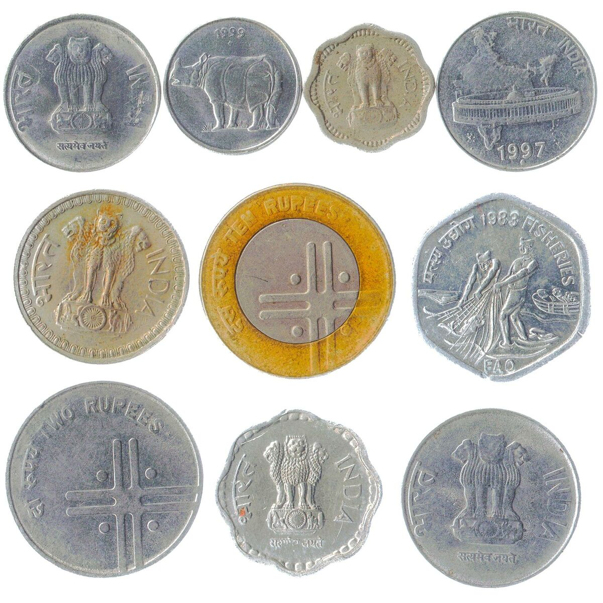

Input image: `images/input_coins.jpg`

The code can be found at `coin_detection.py`. On running the python script, it reads the input image from `images/input_coins.jpg` and writes the following files as an output to the `images` directory:

- `images/coin-detection-canny.jpg` - canny detected edges
- `images/coin-detection-contours.jpg` - detected contours
- `images/coin-detection-region-based-segmented.jpg` - region based segmentation
- `images/coin_1.jpg` to `images/coin_10.jpg` - individual segmented coins

### **1. Image preprocessing**
- Median blurring - `cv2.medianBlur` was used to remove noise. Median blurring is better at preserving edges than Gaussian blurring, which is more useful in this case.

- `cv2.cvtColor` was used to convert the image to grayscale. This was used in Canny edge detection to simplify gradient calculations.

- Thresholding with Otsu’s method - `cv2.threshold` was used to convert the grayscale image into a binary image. Otsu’s method automatically selects the best threshold based on histogram analysis to separate objects from the background. The produced binary image was used in region-based segmentation.

---

### **2. Edge detection and contour detection**
- Detected edges using Canny edge detection - `cv2.Canny`. It uses intensity changes in the image. Canny worked better after the two thresholds were tweaked to achieve a more accurate edge detection.
Although if any coins were close together, the edges were not detected accuractely.

    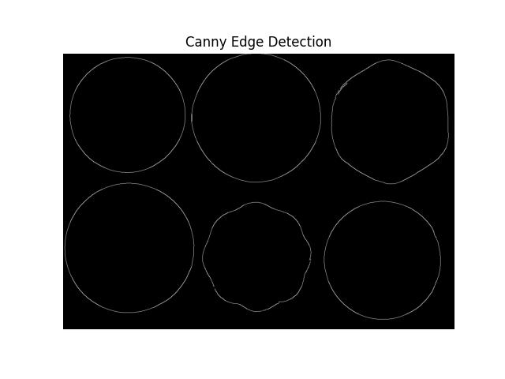

image: `images/coin-detection-canny.jpg`

- Edges were strengthened using `cv2.dilate` to ensure complete contours. Increasing the number of iterations improved contour detection.

- `cv2.findContours` identified the boundaries of coins based on detected edges. A green boundary was drawn around each coin.

    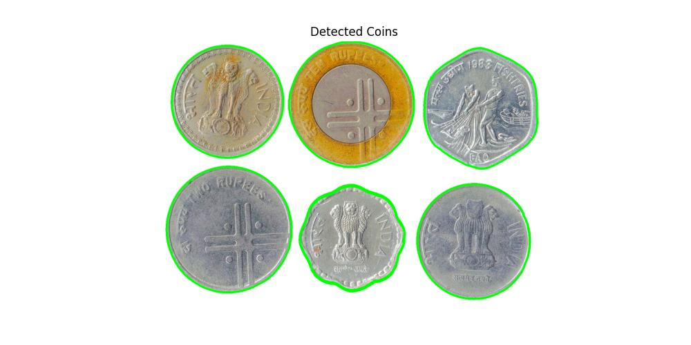

image: `images/coin-detection-contours.jpg`

---

### **3. Region-based segmentation**
- Morphological opening - `cv2.morphologyEx` was used to remove small noise in the thresholded image.

- Distance Transform - `cv2.distanceTransform` was used to identify the center of objects to ensure proper separation. Lowering the threshold (to 0.2) ensured that coins were detected more fully and distinctly. Each pixel is assigned a value based on its distance from the nearest background pixel. 

- Watershed Algorithm - `cv2.watershed`, which is a region-based segmentation method was used to segment each coin. It separates touching coins by treating them as topographical regions.  
  The algorithm assigned labels as follows:  
    - `1` → Background  
    - `2, 3, 4,...` → Different segmented objects  
    - `-1` → Object boundaries (watershed lines), which help separate overlapping coins.

    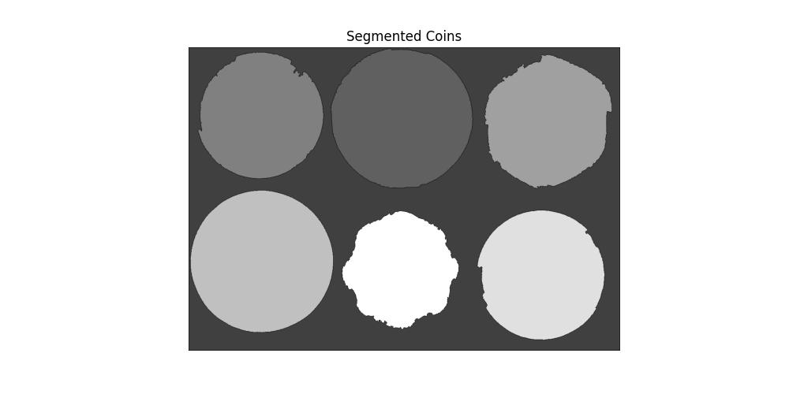

image: `images/coin-detection-region-based-segmented.jpg`

---

### **4. Segmentation and Counting of Coins**
- `cv2.connectedComponents` was used to assign a unique label to each coin by labeling connected objects in the sure foreground.
- Contours in Labeled Regions, `cv2.findContours` - Counted the segmented coins.
- A mask was created for each individual coin using `cv2.bitwise_and`. 
  A bounding box was applied using `cv2.boundingRect` to isolate each coin clearly and extract as a separate image.

#### **Code Output:**
The number of objects in this image: **10**  

#### **Segmented Coin Images:**

    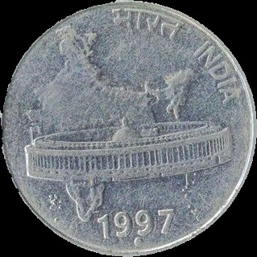
    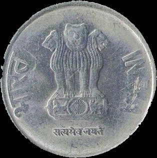
    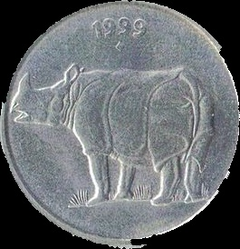
    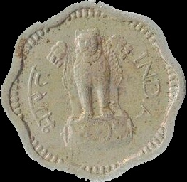
    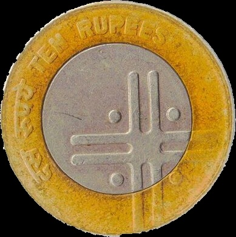
    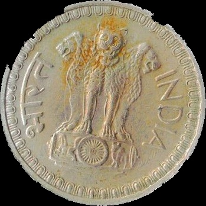
    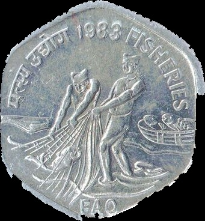
    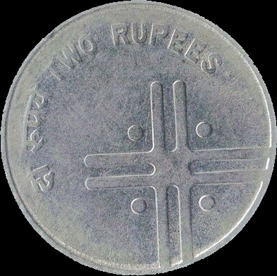
    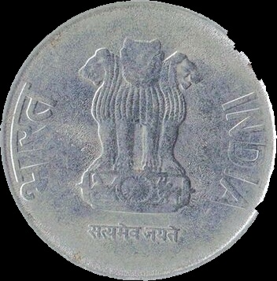
    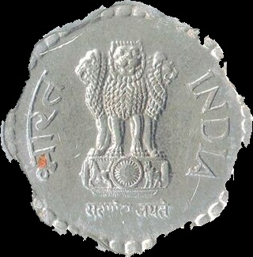

images: `images/coin_1.jpg` to `images/coin_10.jpg`

---

#### **Observations:**
- The final count of coins was accurate for well-separated coins.
- In cases where coins were highly overlapping, the segmentation sometimes grouped them as a single object, highlighting a limitation of the watershed approach.

---

## Image stitching

The following images were stitched to create a panorama:

    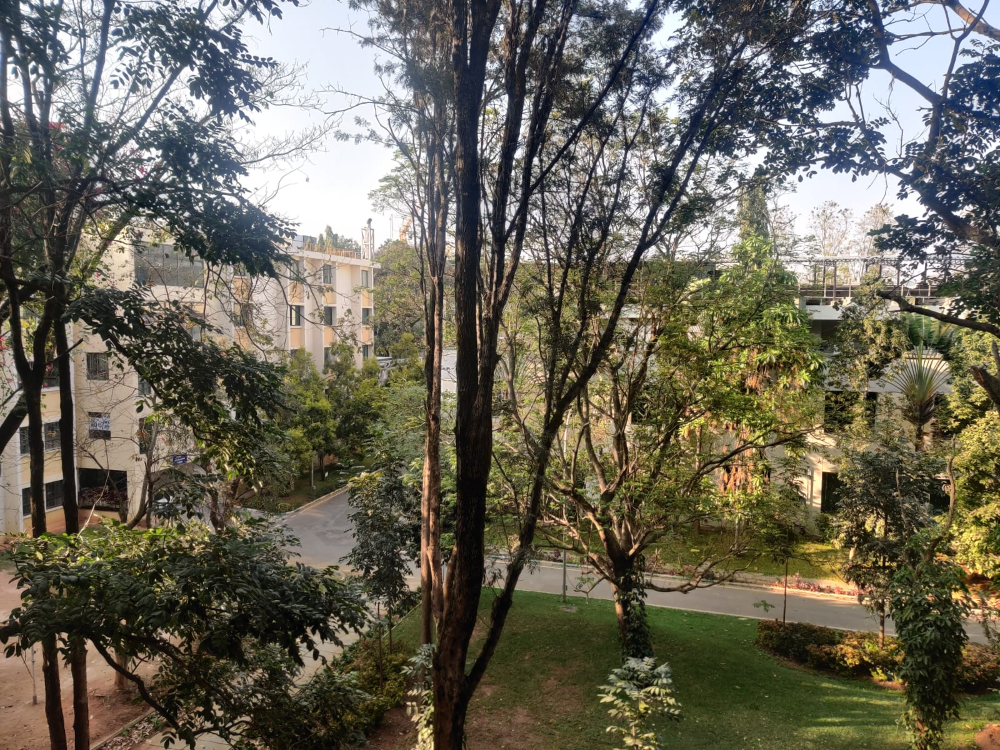
    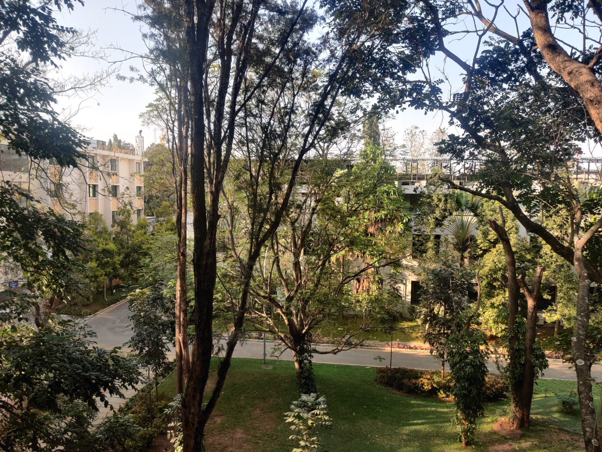
    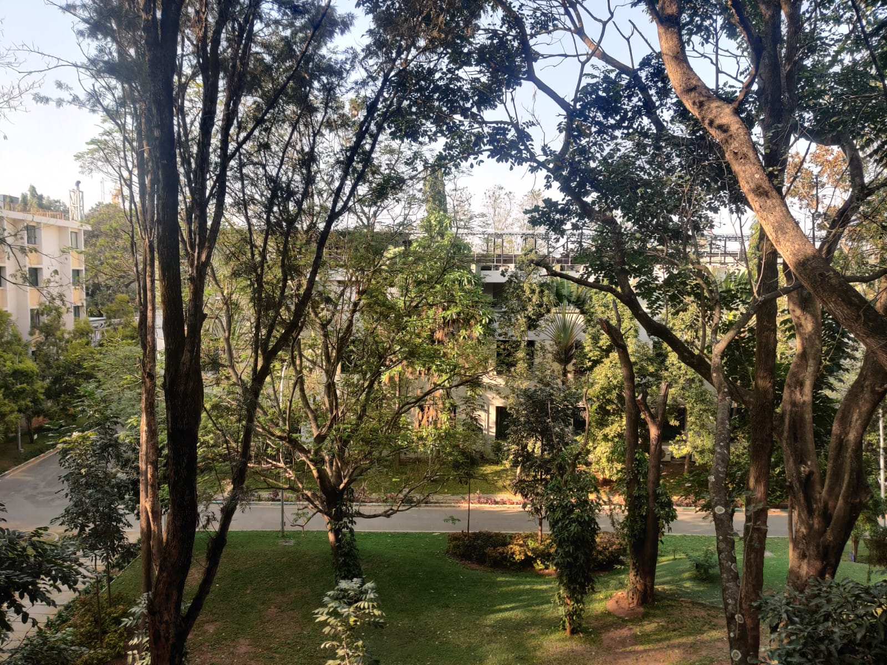
    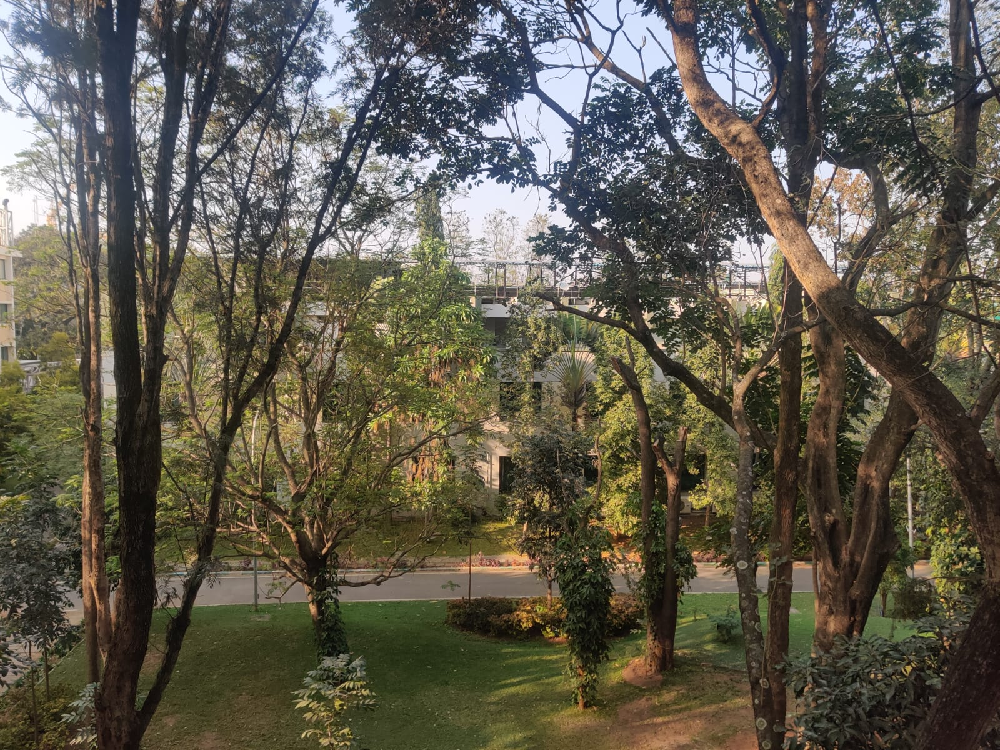

images: `images/1.jpeg` to `images/4.jpeg`

 
The code can be found at `panorama.py`. On running the python script, it reads 4 overlapping input images from `images/1.jpg` to `images/4.jpg` and writes the following files as an output to the `images` directory:

- `images/keypoint-matches-1-and-reference.jpg` - matching keypoints between image 1 and reference image (image 2 is the initial reference image)
- `images/keypoint-matches-3-and-reference.jpg` - matching keypoints between image 3 and reference image
- `images/keypoint-matches-4-and-reference.jpg` - matching keypoints between image 4 and reference image
- `images/final-panorama.jpg` - final stitched image

---

### 1. Keypoint matching

- Detected keypoints and descriptors using SIFT (Scale-Invariant Feature Transform) - `cv2.SIFT_create()`
- Initially, BFMatcher (Brute Force Matcher) was used to find keypoint correspondences, but it was found to be slow and less accurate. Instead, FLANN (Fast Library for Approximate Nearest Neighbors) - `cv2.FlannBasedMatcher`, was used. It provided better speed and accuracy.
- Lowe’s Ratio Test was applied to filter good matches and remove incorrect correspondences.

    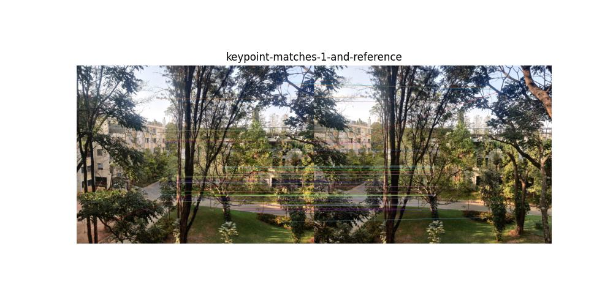

<centre> Keypoint matches between image 1 and image 2</centre>

image: `images/keypoint-matches-1-and-reference.jpg`

### 2. Compute homography

- A homographix traansformation was made to transform each image into the same plane.
- RANSAC (Random Sample Consensus) was used to compute the homography matrix from the matched keypoints - `cv2.findHomography()`. Without RANSAC, alignment accuracy was poorer.

### 3. Warping

- Image 2 was used as the first reference image. After the first iteration, the stitched image 1 and 2 is the reference image. The other images were warped one by one into the reference image.
- The corners of the image we transformed first. Then back-warping was used to prevent holes in the created image.
- Perspective transformation was applied using the computed homography matrix H - `cv2.warpPerspective()`. Using the `cv2.INTER_CUBIC` flag (bicubic interpolation) instead of `cv2.INTER_LINEAR` improved the smoothness of edges and alignment of features after warping. It considers a 4×4 neighborhood of pixels to estimate new pixel values.
- The image was translated to ensure no negative pixel values.
- After warping, some images experienced slight distortions due to perspective transformation. Some black regions (empty areas) also appeared due to perspective transformation.

### 4. Blending images

- Weighted blending was used to remove visible seams between images.
- Binary masks were created for both images to identify overlapping regions. A weighted average  was computed for overlapping regions.
- The images were blended using the computed weights to remove seams.

After processing all images with the above steps, the final stitched panorama was generated.

    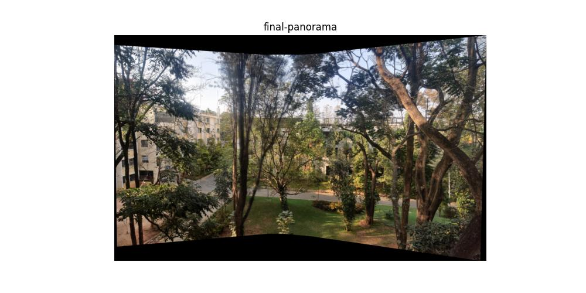

<centre> Final stitched panorama</centre>

image: `images/final-panorama.jpg`
