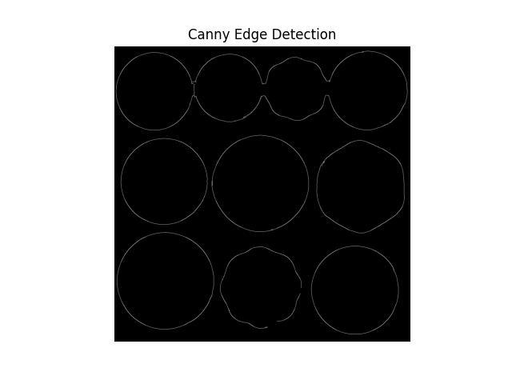
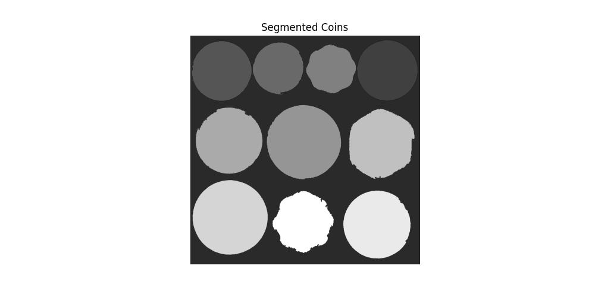

# VR_Assignment1_Dyuthi-Vivek_IMT2022523

## Coin detection

  
Input image file: `coins.jpg`

---

### **1. Image preprocessing**
- **Median blurring (`cv2.medianBlur`)** - Used to remove noise while preserving edges.

- **Grayscale conversion (`cv2.cvtColor`)** - Converted the image to grayscale. This was used in Canny edge detection to simplify gradient calculations.

- **Thresholding with Otsu’s Method (`cv2.threshold`)** - Converted the grayscale image into a binary image. Otsu’s method automatically selects the best threshold based on histogram analysis to separate objects from the background. The produced binary image was used in region-based segmentation.

---

### **2. Edge detection and contour detection**
- **Canny Edge Detection (`cv2.Canny`)** - Detected edges by calculating intensity changes in the image. Canny worked well after the two thresholds were tweaked to achieve a more accurate edge detection.

  
file: `images/coin-detection-canny.jpg`

- **Dilation (`cv2.dilate`)** - Strengthened the edges to ensure complete contours. Increasing the number of iterations improved contour detection by reinforcing the edges.

- **Contour detection (`cv2.findContours`)** - Identified the boundaries of coins based on detected edges. A green boundary was drawn around each coin.

  
file: `images/coin-detection-contours.jpg`

---

### **3. Region-based segmentation**
- **Morphological Opening (`cv2.morphologyEx`)** - Used to remove small noise in the thresholded image.

- **Distance Transform (`cv2.distanceTransform`)** - Used to identify the center of objects to ensure proper separation. Lowering the threshold (to 0.2) ensured that coins were detected more fully and distinctly.

- **Watershed Algorithm (`cv2.watershed`)** - This region-based segmentation method was used to segment each coin. It separates touching coins by treating them as topographical regions.  
  The algorithm assigns labels as follows:  
    - `1` → Background  
    - `2, 3, 4,...` → Different segmented objects  
    - `-1` → Object boundaries (watershed lines), which help separate overlapping coins.

  
file: `images/coin-detection-region-based-segmented.jpg`

---

### **4. Segmentation and Counting of Coins**
- **Connected Components Analysis (`cv2.connectedComponents`)** - Assigned a unique label to each coin by labeling connected objects in the sure foreground.
- **Contours in Labeled Regions (`cv2.findContours`)** - Counted the segmented coins.
- **Extracted each coin as a separate image** - A mask was created for each individual coin using **`cv2.bitwise_and`**.  
  A bounding box was applied using **`cv2.boundingRect`** to isolate each coin clearly.

#### **Code Output:**
The number of objects in this image: **6**  

#### **Segmented Coin Images:**

    
    
    
    
    
    

---

#### **Observations:**
- The final count of coins was accurate for well-separated coins.
- In cases where coins were highly overlapping, the segmentation sometimes grouped them as a single object, highlighting a limitation of the watershed approach.
