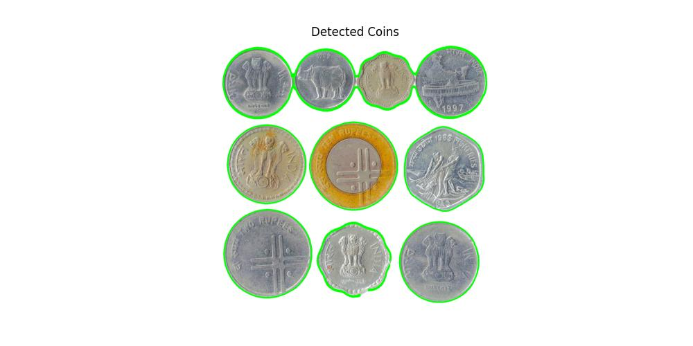
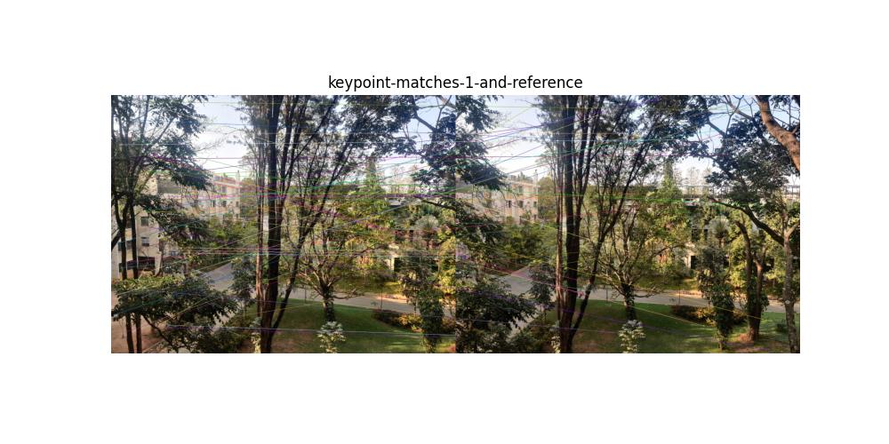

# VR_Assignment1_Dyuthi-Vivek_IMT2022523

## Coin detection

    

Input image: `coins.jpg`

---

### **1. Image preprocessing**
- **Median blurring (`cv2.medianBlur`)** - Used to remove noise while preserving edges.

- **Grayscale conversion (`cv2.cvtColor`)** - Converted the image to grayscale. This was used in Canny edge detection to simplify gradient calculations.

- **Thresholding with Otsu’s Method (`cv2.threshold`)** - Converted the grayscale image into a binary image. Otsu’s method automatically selects the best threshold based on histogram analysis to separate objects from the background. The produced binary image was used in region-based segmentation.

---

### **2. Edge detection and contour detection**
- **Canny Edge Detection (`cv2.Canny`)** - Detected edges by calculating intensity changes in the image. Canny worked better after the two thresholds were tweaked to achieve a more accurate edge detection.
Although if any coins are close together, the edges may not be detected accuractely.

    

image: `images/coin-detection-canny.jpg`

- **Dilation (`cv2.dilate`)** - Strengthened the edges to ensure complete contours. Increasing the number of iterations improved contour detection by reinforcing the edges.

- **Contour detection (`cv2.findContours`)** - Identified the boundaries of coins based on detected edges. A green boundary was drawn around each coin.

    

image: `images/coin-detection-contours.jpg`

---

### **3. Region-based segmentation**
- **Morphological Opening (`cv2.morphologyEx`)** - Used to remove small noise in the thresholded image.

- **Distance Transform (`cv2.distanceTransform`)** - Used to identify the center of objects to ensure proper separation. Lowering the threshold (to 0.2) ensured that coins were detected more fully and distinctly.

- **Watershed Algorithm (`cv2.watershed`)** - This region-based segmentation method was used to segment each coin. It separates touching coins by treating them as topographical regions.  
  The algorithm assigns labels as follows:  
    - `1` → Background  
    - `2, 3, 4,...` → Different segmented objects  
    - `-1` → Object boundaries (watershed lines), which help separate overlapping coins.

    

image: `images/coin-detection-region-based-segmented.jpg`

---

### **4. Segmentation and Counting of Coins**
- **Connected Components Analysis (`cv2.connectedComponents`)** - Assigned a unique label to each coin by labeling connected objects in the sure foreground.
- **Contours in Labeled Regions (`cv2.findContours`)** - Counted the segmented coins.
- **Extracted each coin as a separate image** - A mask was created for each individual coin using **`cv2.bitwise_and`**.  
  A bounding box was applied using **`cv2.boundingRect`** to isolate each coin clearly.

#### **Code Output:**
The number of objects in this image: **10**  

#### **Segmented Coin Images:**

    
    
    
    
    
    
    
    
    
    

images: `images/coin_1.jpg` to `images/coin_10.jpg`

---

#### **Observations:**
- The final count of coins was accurate for well-separated coins.
- In cases where coins were highly overlapping, the segmentation sometimes grouped them as a single object, highlighting a limitation of the watershed approach.

---

## Image stitching

The following images were stitched to create a panorama:

    
    
    
    

### 1. Keypoint matching

- Detected keypoints and descriptors using SIFT (Scale-Invariant Feature Transform) - `cv2.SIFT_create()`
- Initially, BFMatcher (Brute Force Matcher) was used to find keypoint correspondences, but it was found to be slower and less accurate for large feature sets. Instead, FLANN (Fast Library for Approximate Nearest Neighbors) - `cv2.FlannBasedMatcher`, was used. It provided better speed and accuracy.
- Lowe’s Ratio Test was applied to filter good matches and remove incorrect correspondences.

    

<centre> Keypoint matches between image 1 and image 2</centre>

image: `images/keypoint-matches-1-and-reference.jpg`

### 2. Compute homography

- A homographix traansformation was made to transform each image into the same plane.
- RANSAC (Random Sample Consensus) was used to compute the homography matrix from the matched keypoints - `cv2.findHomography()`. Without RANSAC, alignment accuracy was poorer.

### 3. Warping

- The corners of the image we transformed first. Then back-warping was used to prevent holes in the created image.
- Perspective transformation was applied using the computed homography matrix H - `cv2.warpPerspective()`. Using the `cv2.INTER_CUBIC` flag (bicubic interpolation) instead of `cv2.INTER_LINEAR` improved the smoothness of edges and alignment of features after warping. It considers a 4×4 neighborhood of pixels to estimate new pixel values.
- The image was translated to ensure no negative pixel values.
- Image 2 was used as a reference image. The other images were warped one by one into the reference image.
- Some black regions (empty areas) appeared due to perspective transformation.

### 4. Blending images

- Weighted blending was used to remove visible seams between images.
- Binary masks were created for both images to identify overlapping regions. A weighted average  was computed for overlapping regions.
- The images were blended using the computed weights to remove seams.

After processing all images with the above steps, the final stitched panorama was generated.

    

<centre> Final stitched panorama</centre>

image: `images/final-panorama.jpg`
